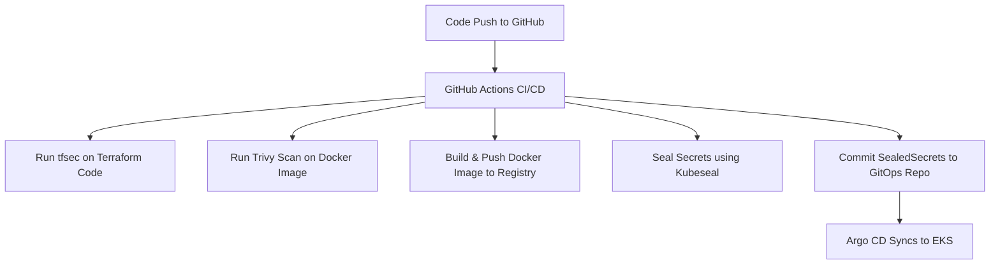

<div align="center">

# 🚀 DevSecOps CI/CD Pipeline on EKS using GitHub Actions, Sealed Secrets & Argo CD

Automated, Secure, and GitOps-driven delivery pipeline leveraging modern DevSecOps best practices.

</div>

---

## 🛠️ Tech Stack

| Layer            | Tools Used                            |
| ---------------- | ------------------------------------- |
| CI/CD            | GitHub Actions                        |
| Infrastructure   | Terraform                             |
| Security         | `tfsec` (Terraform), `Trivy` (Docker) |
| Secrets          | Sealed Secrets (Kubeseal)             |
| Deployment       | Argo CD (GitOps to EKS)               |
| Containerization | Docker                                |


---

## 🔁 Workflow Overview



---

## 🔐 Sealed Secrets Workflow

1. **Generate Kubernetes Secrets**:

   ```bash
   kubectl create secret generic my-secret --from-literal=username=admin --dry-run=client -o yaml > my-secret.yaml
   ```

2. **Encrypt with Kubeseal**:

   ```bash
   kubeseal --cert pub-cert.pem < my-secret.yaml > my-secret-sealed.yaml
   ```

3. **Commit `my-secret-sealed.yaml` to GitHub**.

---

## ⚙️ GitHub Actions CI/CD Features

* ✅ Runs on every `push` to main/dev branches
* ✅ `tfsec` Terraform static code analysis
* ✅ `Trivy` Docker vulnerability scanning
* ✅ Build & push Docker image
* ✅ Apply sealed secrets to cluster
* ✅ Argo CD sync triggers deployment

---

## 📁 Directory Structure

```bash
.
├── .github/workflows/
│   └── main.yml
├── infra/
│   └── main.tf  # Terraform infra code
|   └── secret.yaml
|   └── variables.tf
├── manifests/
│   └── deployment.yaml
│   └── service.yaml
├── Dockerfile
├── README.md
```

---

## 📦 Sample GitHub Actions Workflow (`.github/workflows/main.yml`)

```yaml
name: DevSecOps CI/CD

on: [push]

jobs:
  build-and-scan:
    runs-on: ubuntu-latest
    steps:
      - name: Checkout repo
        uses: actions/checkout@v3

      - name: Run tfsec
        uses: aquasecurity/tfsec-action@v1.0.0

      - name: Run Trivy Scan
        uses: aquasecurity/trivy-action@master
        with:
          image-ref: your-docker-image:latest

      - name: Build Docker Image
        run: docker build -t your-image-name .

      - name: Seal Secrets
        run: |
          kubeseal --cert pub-cert.pem < k8s-secret.yaml > sealed-secret.yaml

      - name: Push to GitOps Repo (if needed)
        run: |
          git config --global user.name "github-actions"
          git config --global user.email "actions@github.com"
          git add .
          git commit -m "Update sealed secrets"
          git push
```

---

## 🚀 Deployment

Argo CD watches the GitOps repository and applies changes automatically to the EKS cluster.

```bash
argocd app sync your-app
```

---

## 🔒 Security Highlights

* ✅ Secrets encrypted using **Sealed Secrets**
* ✅ Infrastructure scanned using **tfsec**
* ✅ Container images scanned using **Trivy**
* ✅ GitOps ensures tamper-proof deployments

---

## 👨‍💻 Author

sudhansu sahoo

---

> Made with ❤️ for DevSecOps excellence
